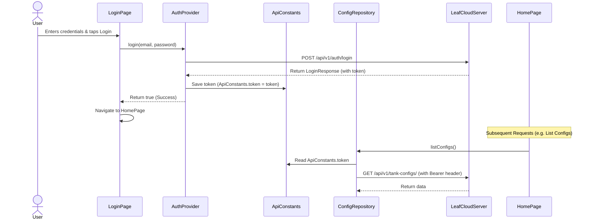

# JWT Authentication & Token Integration

This document describes the design and implementation of JWT authentication on the mobile client, enabling secure access to protected endpoints on the LeafCloud Server.

## 1. Overview

The LeafCloud Server protects user-facing routes (such as configurations, history logs, and sensor calibrations) by requiring a JSON Web Token (JWT) in the request headers. 
- **Header format**: `Authorization: Bearer <token>`
- **Token acquisition**: The mobile app fetches this token via `POST /api/v1/auth/login` (handled by the login flow).

---

## 2. Architectural Flow & Implementation

We introduced an automated, non-invasive token forwarding mechanism that ensures all backend-facing repositories transparently attach the bearer token when available.



---

## 3. Detailed Changes

### A. Centralized Token Storage (`lib/core/constants.dart`)
Added a static nullable `token` property to `ApiConstants` to cache the active user session token:
```dart
class ApiConstants {
  static String? token;
  // ...
}
```

### B. Session State Management (`lib/providers/auth_provider.dart`)
Updated the authentication provider to coordinate token lifecycle operations:
- **On Login Success**: Caches the returned JWT token to `ApiConstants.token`.
- **On Logout**: Exposes a `logout()` method to set the cached token and login response back to `null`, ensuring request headers are immediately cleared.
```dart
  Future<bool> login(String email, String password) async {
    // ...
    try {
      _loginResponse = await _authRepository.login(email, password);
      ApiConstants.token = _loginResponse?.token; // Store token
      // ...
    } catch (e) { /* ... */ }
  }

  void logout() {
    _loginResponse = null;
    ApiConstants.token = null; // Clear token
    notifyListeners();
  }
```

### C. Drawer Logout Action (`lib/ui/home_page.dart`)
Hooked up the Navigation Drawer's "Logout" menu tile to invoke the auth provider's `logout()` action before routing the user back to the login screen:
```dart
            ListTile(
              leading: const Icon(Icons.logout, color: Colors.red),
              title: const Text('Logout'),
              onTap: () {
                Provider.of<AuthProvider>(context, listen: false).logout();
                Navigator.pushNamedAndRemoveUntil(context, '/', (route) => false);
              },
            ),
```

### D. Protected Repositories
The following repositories have been updated with a private helper method `_getHeaders()` that dynamically constructs HTTP headers. It injects the `Authorization: Bearer <token>` header on all requests if a token is present:
- **`ConfigRepository`** (`lib/repositories/config_repository.dart`)
- **`IotRepository`** (`lib/repositories/iot_repository.dart`)
- **`CalibrationRepository`** (`lib/repositories/calibration_repository.dart`)

```dart
  Map<String, String> _getHeaders() {
    final headers = {'Content-Type': 'application/json'};
    if (ApiConstants.token != null) {
      headers['Authorization'] = 'Bearer ${ApiConstants.token}';
    }
    return headers;
  }
```
All HTTP methods (`get`, `post`, `patch`, `delete`) in these repositories now query this helper function.
