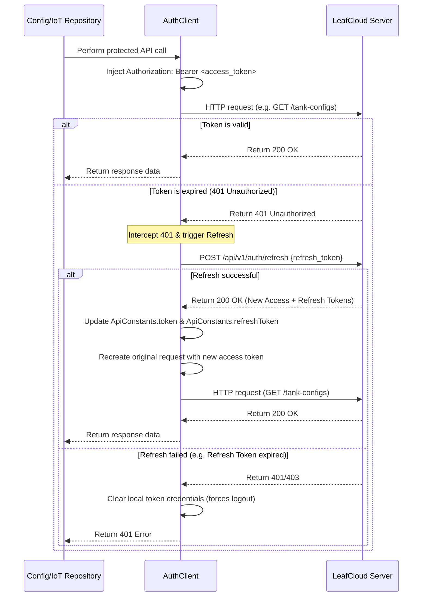

# Token Lifecycle Management: Access + Refresh Tokens

This document describes the client-side architecture and implementation of the dual-token system (Access + Refresh) and Token Rotation (RTR) to support secure sessions and instant logout blacklisting.

---

## 1. Overview

To resolve security gaps where JWTs cannot be revoked on demand, the client integrates with the LeafCloud Server's dual-token authentication structure:
1. **Access Token (Short-lived JWT)**: Valid for 30 minutes. Transmitted in headers to query protected APIs.
2. **Refresh Token (Long-lived DB key)**: Valid for 7 days. Stored locally, used to silently renew expired access tokens.
3. **Refresh Token Rotation (RTR)**: Every refresh request revokes the old refresh token and issues a brand-new access and refresh token pair to prevent session hijacking.
4. **Instant Logout**: Blacklists the access token `jti` and invalidates the database refresh token.

---

## 2. Dynamic Interception Architecture (`lib/core/auth_client.dart`)

Instead of requiring individual repositories to manually check expiration bounds and perform checks, we implemented an `AuthClient` inheriting from `http.BaseClient`:



---

## 3. Class Changes

### A. Centralized Token Storage (`lib/core/constants.dart`)
Extended `ApiConstants` to support holding both tokens globally:
```dart
class ApiConstants {
  static String? token;         // Access Token
  static String? refreshToken;  // Refresh Token
  // ...
}
```

### B. Login Mapping (`lib/models/user_model.dart`)
Updated `LoginResponse` model to parse the `refresh_token` string property returned from `POST /api/v1/auth/login`.

### C. Server-Side Session Logout (`lib/providers/auth_provider.dart`)
Updated the logout sequence to cleanly notify the server and invalidate active DB sessions.
- Instantly clears local states (`_loginResponse`, `token`, `refreshToken`).
- Asynchronously sends a background `POST /api/v1/auth/logout` query containing the `refresh_token` and `Authorization` headers to blacklist the session.

```dart
  Future<void> logout() async {
    final accessToken = ApiConstants.token;
    final refreshToken = ApiConstants.refreshToken;

    // Clear local state instantly
    _loginResponse = null;
    ApiConstants.token = null;
    ApiConstants.refreshToken = null;
    notifyListeners();

    // Invalidate server session in background
    if (accessToken != null && refreshToken != null) {
      try {
        await _authRepository.logout(accessToken, refreshToken);
      } catch (e) {
        debugPrint('Logout request failed: $e');
      }
    }
  }
```

### D. Repository Dependency Injection (`lib/main.dart`)
Configured [ConfigRepository](file:///Users/fil/Fil/leafcloud/mimeng_leafcloud_app_v2/lib/repositories/config_repository.dart), [IotRepository](file:///Users/fil/Fil/leafcloud/mimeng_leafcloud_app_v2/lib/repositories/iot_repository.dart), and [CalibrationRepository](file:///Users/fil/Fil/leafcloud/mimeng_leafcloud_app_v2/lib/repositories/calibration_repository.dart) to receive `AuthClient()` as their default HTTP client parameter, enabling automatic, non-invasive token management and renewal.
