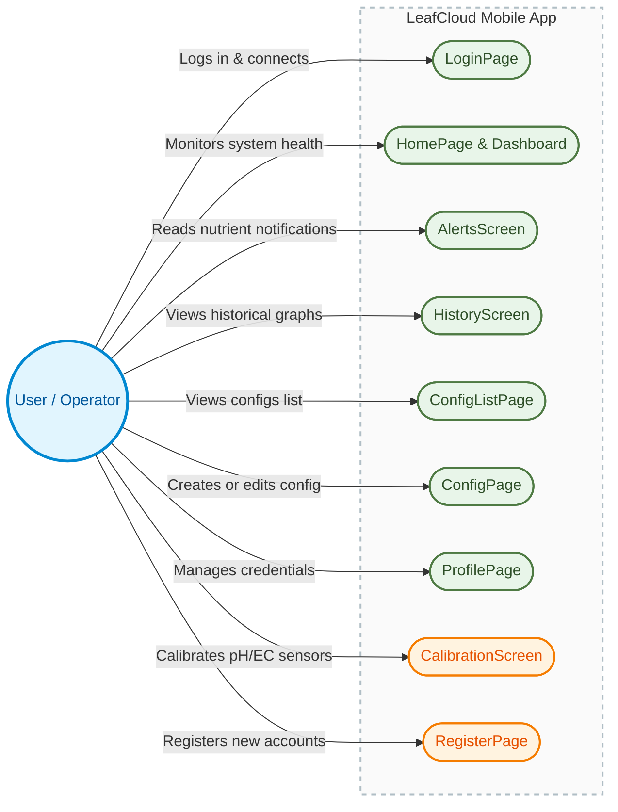

# User Screen Interaction Diagram

This diagram shows the User interacting with the screens from the outside, with all screens grouped inside a single container representing the **LeafCloud Mobile App**.

---

### Mermaid Source Code

If you need to edit or recompile the diagram, here is the original Mermaid source:

